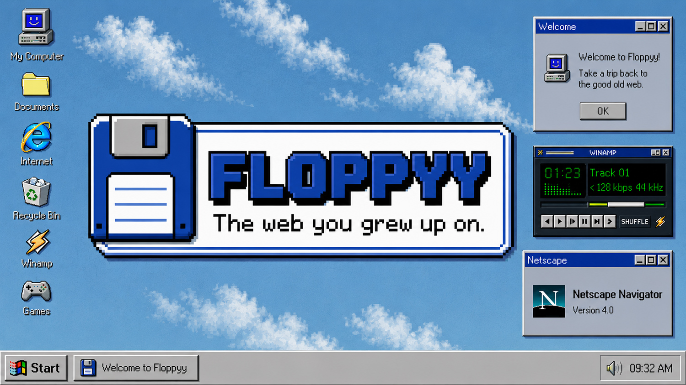

# Floppyy



Floppyy is a browser desktop built on pure nostalgia.
Boot up, click around, remember everything — minus the dial-up wait.
Mostly.

> The web you grew up on.


## What is Floppyy?

Floppyy is a retro computer in your browser.

It brings back the feeling of old desktop systems, pixel windows, floppy disks, BIOS boot screens, Winamp vibes, classic games, and the early web — rebuilt as a playful browser experience.

Not an emulator.

Not a productivity tool.

Just a small machine for good old internet memories.

## Features

### Desktop Environment
- BIOS POST → boot sequence → desktop
- Draggable desktop icons with grid snapping
- Drag icons onto the Recycle Bin to delete them (with empty/full bin states and Empty Recycle Bin)
- Right-click context menu (Arrange Icons, Line Up, Refresh, Properties, Empty Recycle Bin)
- Window management — open, close, minimize, maximize, drag, resize, z-order
- Start Menu with program list and Shut Down
- Taskbar with Start button, quick launch, window buttons, system tray clock
- Keyboard shortcuts — Ctrl+Esc, Alt+F4, Enter to open

### Applications
- **Notepad** — text editor with File/Edit/Search/Format menus, word wrap
- **Paint** — full drawing app with pencil, brush, eraser, fill, shapes, color palette, undo
- **Calculator** — functional calculator
- **Internet Explorer** — loads real 1998 websites via Wayback Machine
- **Netscape Navigator** — retro alternative browser
- **MS-DOS Prompt** — command-line interface with working commands
- **Outlook Express** — email client UI
- **Norton Commander** — dual-pane file manager
- **Windows Media Player** — video playback
- **Winamp** — music player (frameless, authentic skin)
- **My Computer / My Documents / Local Disk** — file system browsing
- **Projects** — portfolio browser with project details
- **Control Panel & Display Settings** — system configuration
- **Disk Defragmenter** — animated defrag utility
- **Recycle Bin** — holds deleted desktop icons, restore or empty
- **Run** dialog, **Share** dialog, and **About / Credits**
- **Screensavers** — Pipes, Starfield, Maze, Mystify, Flying Windows

### Games
- **Doom** — 3D raycasting FPS with enemies, weapons, 3 levels
- **Duke Nukem 3D** — raycasting shooter
- **Shadow Warrior** — raycasting shooter
- **Minesweeper** — classic mine-clearing puzzle
- **Solitaire** — card game
- **Snake** — arcade snake game

### System
- Sound effects via Web Audio API with oscillator fallback
- Screensaver activation after idle timeout
- Service worker for offline support
- Safe Mode boot option
- Shut Down with "It's now safe to turn off your computer" screen
- Share dialog for social sharing

## Tech Stack

- **Next.js 16** — App Router, Turbopack
- **React 19** — latest concurrent features
- **TypeScript 5.9** — strict type safety
- **Tailwind CSS 4** — utility-first styling + custom Win98 CSS
- **Web Audio API** — sound effects
- **Canvas API** — Paint app, Doom renderer
- **HTML5 Video** — Media Player
- **Service Worker** — offline caching

## Getting Started

> Requires Node.js 20.9.0 or later.

```bash
# Install dependencies
npm install

# Development server
npm run dev

# Production build
npm run build
npm start
```

Open [http://localhost:3000](http://localhost:3000) in your browser.

## Browser Support

Works in all modern browsers. Best experienced on desktop at 1024×768 or higher.

## License

MIT

---

Visit [www.floppyy.com](https://www.floppyy.com)
